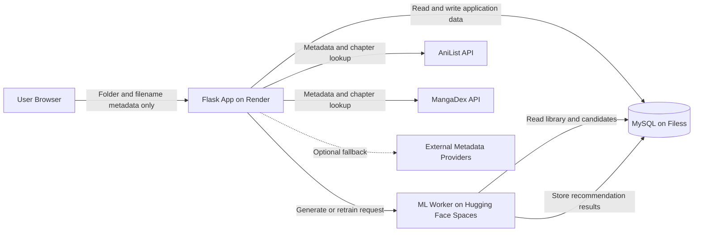

# ManhwaTBR

A cloud-based manhwa library tracker and personalized recommendation system. ManhwaTBR lets users select a local manhwa folder or chapter files in the browser, extracts title and chapter information from their names, tracks reading progress, checks for newer chapters, and generates personalized recommendations using Sentence-BERT.

> **Current architecture:** ManhwaTBR does **not** fetch updates from Telegram. The active workflow uses browser-based folder/file import, AniList and MangaDex metadata, a Flask application hosted on Render, a MySQL database hosted on Filess, and a Hugging Face Space for machine-learning computation.

## Features

### Browser-Based Library Import

* Select an entire manhwa folder or multiple chapter files from the Library page.
* Detect manhwa titles and chapter numbers from folder paths and filenames.
* Recognize common patterns such as `Chapter 120`, `Ch 120`, `Episode 120`, and `Ep 120`.
* Group files belonging to the same title.
* Save the highest detected chapter as the user’s current progress.
* Flag unclear names for manual review instead of saving unreliable data.

### Privacy-Friendly File Scanning

Folder parsing happens inside the browser.

The application sends only extracted metadata such as:

* Detected title
* Latest chapter number
* File count
* Review status

The original chapter files and their contents are **not uploaded** to the server or stored in the database.

### Personal Library and Progress Tracking

* Maintain a separate library for every registered user.
* Track the latest locally available chapter for each title.
* Edit chapter progress manually when automatic detection is incorrect.
* Mark library titles as liked, neutral, or unliked.
* View cover images and remote chapter information.
* See which titles have new chapters available.
* Review titles with uncertain or conflicting metadata.

### Remote Chapter Synchronization

* Search MangaDex for current chapter information.
* Use AniList metadata and available chapter totals as an additional source.
* Compare remote chapter data with the user’s saved local progress.
* Calculate how many chapters the user is behind.
* Flag uncertain or conflicting matches for manual review.
* Support manual chapter overrides when external metadata is incomplete.
* Optionally use configured external metadata providers as fallbacks.

### Personalized Recommendations

* Build a taste profile from the user’s library and preferences.
* Generate semantic embeddings using Sentence-BERT.
* Compare the user’s taste profile against a recommendation candidate pool.
* Populate candidates using AniList and MangaDex data.
* Exclude titles already in the user’s library or marked as already read.
* Combine semantic similarity, genre overlap, popularity, rating, freshness, and feedback.
* Apply diversity reranking to avoid repetitive recommendations.
* Display an explanation for why each title was recommended.

### Feedback-Based Learning

Users can interact with recommendations by marking them as:

* Liked
* Disliked
* Saved
* Already read
* Clicked
* Ignored

These actions are stored as recommendation events.

After enough labelled feedback is available, the Hugging Face worker can retrain user-specific scoring weights so that future recommendations better reflect that user’s taste.

### Dashboard, Search, and Accounts

* User signup, login, and logout
* Session-based authentication
* Password hashing with Werkzeug
* Dashboard statistics for tracked titles, updates, and recommendations
* Completion and library progress insights
* Recently updated titles
* Genre insights
* Search across available manhwa metadata
* Add search results directly to the user’s library
* Responsive Flask and Jinja interface
* Tailwind CSS and JavaScript frontend

## How It Works



### 1. Import

The user selects a folder or multiple chapter files through the Library page.

JavaScript reads the file names and `webkitRelativePath`, detects titles and chapter numbers, groups matching files, and sends a compact JSON summary to the Flask backend.

### 2. Store

The Flask application stores:

* Global title information in `series`
* User-specific library progress in `user_series`
* Metadata in `manhwa_meta`
* Recommendation candidates in `trending_manhwa`
* Feedback and recommendation results in user-specific tables

The deployed application uses a MySQL database hosted on Filess.

### 3. Synchronize

The application checks AniList and MangaDex for metadata and remote chapter information.

It compares the best available remote chapter with the user’s saved chapter and determines whether an update is available.

Uncertain results are marked for review instead of being treated as confirmed updates.

### 4. Recommend

The Flask application sends the authenticated user’s ID to a protected FastAPI worker hosted on Hugging Face Spaces.

The worker:

1. Reads the user’s library from MySQL.
2. Reads available recommendation candidates.
3. Builds a taste profile.
4. Generates Sentence-BERT embeddings.
5. Calculates hybrid recommendation scores.
6. Applies diversity reranking.
7. Stores the final recommendations in MySQL.

### 5. Learn

Recommendation interactions are logged as labelled events.

Once at least 20 usable feedback examples containing both positive and negative signals are available, the worker can learn personalized scoring weights for that user.

## Folder and Filename Detection

The browser importer attempts to identify titles and chapter numbers from common naming structures.

Examples include:

```text
Solo Leveling/Chapter 120/file.jpg
Solo Leveling/Ch 120.pdf
Omniscient Reader Episode 210.cbz
Eleceed Ep 290.zip
[170] The Greatest Estate Developer
```

The importer:

1. Reads the relative file path.
2. Searches the filename and folder names for chapter patterns.
3. Extracts the most likely series title.
4. Normalizes the title into a canonical value.
5. Groups files belonging to the same title.
6. Keeps the highest detected chapter number.
7. Flags unidentified titles for review.

Only the resulting metadata summary is submitted to the backend.

## Recommendation Engine

The machine-learning worker uses the following Sentence-Transformer model:

```text
sentence-transformers/paraphrase-multilingual-MiniLM-L12-v2
```

Each title is represented using:

* Title
* Description
* Genres

Embeddings are normalized and compared using cosine similarity.

### Taste Profile

* Liked library titles receive full positive weight.
* Neutral titles contribute with reduced weight.
* Disliked or unliked titles form a negative taste profile.
* Negative similarity is subtracted from positive semantic similarity.
* Genres from positively weighted titles are used to create the user’s genre profile.

### Default Hybrid Weights

| Signal              | Default weight | Purpose                                                               |
| ------------------- | -------------: | --------------------------------------------------------------------- |
| Semantic similarity |            40% | Measures thematic similarity between the user’s taste and a candidate |
| Genre overlap       |            20% | Uses Jaccard similarity between user and candidate genres             |
| Popularity          |            15% | Normalizes popularity within the candidate pool                       |
| Rating              |            10% | Uses the external average score                                       |
| Freshness           |            10% | Gives more weight to recently updated candidate records               |
| Feedback            |             5% | Adjusts the result using explicit user feedback                       |

The initial score is calculated as:

```text
score =
    0.40 × semantic_similarity
  + 0.20 × genre_overlap
  + 0.15 × popularity
  + 0.10 × rating
  + 0.10 × freshness
  + 0.05 × feedback
```

### Semantic Score

The semantic score compares each candidate with both the positive and negative user profiles:

```text
semantic_score =
    positive_similarity
  - 0.30 × negative_similarity
```

This prevents the system from recommending titles that are highly similar to manhwa the user has disliked.

### Diversity Reranking

The highest-scoring recommendations are reranked using Maximal Marginal Relevance.

The current relevance-diversity balance is:

```text
lambda = 0.75
```

This keeps recommendations relevant while reducing multiple near-identical results.

Up to 20 recommendations are stored for each user.

### Personalized Weight Retraining

The worker trains a small six-feature logistic model using PyTorch when enough feedback is available.

The six features are:

1. Semantic similarity
2. Genre overlap
3. Popularity
4. Rating
5. Freshness
6. Feedback score

The learned weights are:

* Restricted to non-negative values
* Normalized after training
* Stored in `learned_recommendation_weights`
* Used instead of the default weights during later recommendation runs

Training requires:

* At least 20 labelled events
* Both positive and negative feedback examples

## Technology Stack

| Layer                  | Technology                                   |
| ---------------------- | -------------------------------------------- |
| Web application        | Python, Flask, Gunicorn                      |
| Templates and UI       | Jinja, HTML, Tailwind CSS, custom CSS        |
| Client-side processing | Vanilla JavaScript, browser folder picker    |
| Database               | MySQL hosted on Filess                       |
| ML service             | FastAPI hosted on Hugging Face Spaces        |
| Embeddings             | Sentence-Transformers / Sentence-BERT        |
| ML and ranking         | PyTorch, scikit-learn, NumPy, pandas         |
| External metadata      | AniList GraphQL API, MangaDex API            |
| Main deployment        | Render                                       |
| Authentication         | Flask sessions and Werkzeug password hashing |

## Project Structure

```text
ManhwaTBR/
├── app.py
│   └── Flask routes and main application entry point
│
├── config.py
│   └── Environment-based application configuration
│
├── db.py
│   └── MySQL connection helper
│
├── requirements.txt
│   └── Main Flask application dependencies
│
├── services/
│   ├── anilist_service.py
│   │   └── AniList metadata integration
│   │
│   ├── mangadex_service.py
│   │   └── MangaDex search and chapter integration
│   │
│   ├── chapter_discovery_service.py
│   │   └── Selects and validates remote chapter information
│   │
│   ├── trending_population_service.py
│   │   └── Builds the recommendation candidate pool
│   │
│   ├── recommendation_service.py
│   │   └── Sends generation requests to the Hugging Face worker
│   │
│   ├── learning_to_rank_service.py
│   │   └── Sends personalized retraining requests
│   │
│   ├── feedback_service.py
│   │   └── Stores explicit recommendation feedback
│   │
│   ├── title_parser.py
│   │   └── Title normalization and parsing helpers
│   │
│   └── ...
│
├── hf_worker/
│   ├── app.py
│   │   └── FastAPI recommendation and retraining worker
│   │
│   ├── Dockerfile
│   │   └── Hugging Face Space container definition
│   │
│   ├── requirements.txt
│   │   └── Machine-learning worker dependencies
│   │
│   └── README.md
│       └── Worker-specific deployment instructions
│
├── templates/
│   └── Jinja pages for dashboard, library, updates,
│       recommendations, search, login, and settings
│
├── static/
│   └── CSS, JavaScript, images, and frontend assets
│
├── migrations/
│   └── Incremental MySQL migration files
│
├── tailwind.config.js
├── package.json
└── README.md
```

## Local Development

### Prerequisites

* Python 3.11 or newer
* MySQL 8 or a compatible hosted MySQL database
* `pip`
* Node.js only when changing the frontend build setup

### 1. Clone the Repository

```bash
git clone https://github.com/mukuuund/ManhwaTBR.git
cd ManhwaTBR
```

### 2. Create a Virtual Environment

```bash
python -m venv venv
```

On Windows:

```bash
venv\Scripts\activate
```

On macOS or Linux:

```bash
source venv/bin/activate
```

### 3. Install the Flask Dependencies

```bash
pip install -r requirements.txt
```

### 4. Configure MySQL

Create a database:

```sql
CREATE DATABASE manhwa_tracker
CHARACTER SET utf8mb4
COLLATE utf8mb4_unicode_ci;
```

The project currently uses a base schema together with incremental migration files.

Import the project’s current base schema or existing database dump and apply the required migrations in order.

Core tables used by the current application include:

```text
users
series
user_series
manhwa_meta
trending_manhwa
user_feedback
recommendation_results
recommendation_events
learned_recommendation_weights
```

### 5. Create the Flask Environment File

Create a `.env` file in the project root:

```env
DB_HOST=localhost
DB_PORT=3306
DB_USER=root
DB_PASSWORD=your_mysql_password
DB_NAME=manhwa_tracker

SECRET_KEY=replace_with_a_long_random_secret
FLASK_ENV=development
FLASK_DEBUG=True

HF_WORKER_URL=http://127.0.0.1:7860
ML_WORKER_SECRET=replace_with_a_shared_random_secret
```

Do not commit `.env` or real database credentials.

### 6. Run the ML Worker Locally

Open another terminal:

```bash
cd hf_worker
python -m venv venv
```

Activate the environment and install the worker dependencies:

```bash
pip install -r requirements.txt
```

Create `hf_worker/.env`:

```env
DB_HOST=localhost
DB_PORT=3306
DB_USER=root
DB_PASSWORD=your_mysql_password
DB_NAME=manhwa_tracker

ML_WORKER_SECRET=replace_with_the_same_shared_random_secret
```

Start the worker:

```bash
uvicorn app:app --host 0.0.0.0 --port 7860
```

The model is loaded lazily. The first recommendation request can therefore take longer while the model is initialized or downloaded.

### 7. Run the Flask Application

From the project root:

```bash
python app.py
```

Open:

```text
http://127.0.0.1:5000
```

The core tracking, search, and update pages can run without the ML worker.

Recommendation generation and personalized retraining require:

```text
HF_WORKER_URL
ML_WORKER_SECRET
```

### 8. Frontend Assets

The repository already includes the CSS used by the application under:

```text
static/css/
```

Node.js is only required when changing the Tailwind build setup or frontend tooling.

The current `package.json` does not define production CSS build scripts, so explicit scripts should be added before using `npm run` commands in CI or deployment.

## Environment Variables

### Flask Application

| Variable           | Required            | Description                               |
| ------------------ | ------------------- | ----------------------------------------- |
| `DB_HOST`          | Yes                 | MySQL hostname                            |
| `DB_PORT`          | Yes                 | MySQL port, normally `3306`               |
| `DB_USER`          | Yes                 | MySQL username                            |
| `DB_PASSWORD`      | Yes                 | MySQL password                            |
| `DB_NAME`          | Yes                 | MySQL database name                       |
| `SECRET_KEY`       | Yes                 | Strong secret used to sign Flask sessions |
| `FLASK_ENV`        | Recommended         | Application environment                   |
| `FLASK_DEBUG`      | Recommended         | Enables or disables debug mode            |
| `HF_WORKER_URL`    | For recommendations | Base URL of the FastAPI ML worker         |
| `ML_WORKER_SECRET` | For recommendations | Secret shared by Render and Hugging Face  |

### Optional Remote Metadata Configuration

| Variable                        | Description                                     |
| ------------------------------- | ----------------------------------------------- |
| `ASURA_ENABLED`                 | Enables or disables the optional Asura fallback |
| `ASURA_BASE_URL`                | Base URL used by the optional Asura provider    |
| `ASURA_URL_TEMPLATE`            | URL template used for title-specific lookups    |
| `SEARCH_ENABLED`                | Enables optional external source discovery      |
| `SEARCH_PROVIDER`               | Configured external search provider             |
| `SERPAPI_API_KEY`               | SerpAPI key for optional source discovery       |
| `SERPAPI_ENGINE`                | SerpAPI engine name                             |
| `LATEST_CHAPTER_PROVIDERS_JSON` | JSON configuration for fallback providers       |

### Hugging Face Worker

| Variable           | Required | Description                                   |
| ------------------ | -------- | --------------------------------------------- |
| `DB_HOST`          | Yes      | Same MySQL host used by the Flask application |
| `DB_PORT`          | Yes      | MySQL port                                    |
| `DB_USER`          | Yes      | MySQL username                                |
| `DB_PASSWORD`      | Yes      | MySQL password                                |
| `DB_NAME`          | Yes      | Shared database name                          |
| `ML_WORKER_SECRET` | Yes      | Must match the secret configured on Render    |

## Cloud Deployment

## 1. Filess MySQL

Create a hosted MySQL database and initialize the required schema.

Save the following values securely:

```text
DB_HOST
DB_PORT
DB_USER
DB_PASSWORD
DB_NAME
```

Do not commit real credentials to GitHub.

Both Render and the Hugging Face worker must connect to the same database because:

* Render stores user and application data.
* The Hugging Face worker reads user libraries and recommendation candidates.
* The worker writes generated recommendations and learned weights back to MySQL.

## 2. Hugging Face Space

Deploy the contents of `hf_worker/` as a Docker-based Hugging Face Space.

Add the following Space secrets:

```text
DB_HOST
DB_PORT
DB_USER
DB_PASSWORD
DB_NAME
ML_WORKER_SECRET
```

The container starts the FastAPI application on port `7860`.

The worker exposes two protected endpoints:

```text
POST /generate
POST /retrain
```

Both endpoints require:

```http
Authorization: Bearer <ML_WORKER_SECRET>
```

## 3. Render Web Service

Create a Python web service from the GitHub repository.

Recommended build command:

```bash
pip install -r requirements.txt
```

Recommended start command:

```bash
gunicorn --bind 0.0.0.0:$PORT --timeout 600 app:app
```

Configure the following Render environment variables:

```env
DB_HOST=your_filess_host
DB_PORT=your_filess_port
DB_USER=your_filess_username
DB_PASSWORD=your_filess_password
DB_NAME=your_filess_database

SECRET_KEY=your_production_secret
FLASK_ENV=production
FLASK_DEBUG=False

HF_WORKER_URL=https://your-space-name.hf.space
ML_WORKER_SECRET=your_shared_worker_secret
```

`ML_WORKER_SECRET` must be identical on Render and Hugging Face Spaces.

### Why the ML Worker Is Separate

Sentence-Transformers and PyTorch use considerably more memory than the Flask interface.

Running them in a separate Hugging Face Space:

* Keeps the Render application lightweight
* Prevents the Flask process from loading the embedding model
* Reduces the chance of memory-related deployment failures
* Separates web requests from heavy ML computation
* Allows the worker and web application to scale independently

## Main Routes and API Endpoints

User-specific routes require an authenticated session.

| Route                                 | Method    | Purpose                                             |
| ------------------------------------- | --------- | --------------------------------------------------- |
| `/signup`                             | GET, POST | Create a user account                               |
| `/login`                              | GET, POST | Sign in                                             |
| `/logout`                             | GET       | End the current session                             |
| `/dashboard`                          | GET       | View library and recommendation statistics          |
| `/library`                            | GET       | View and manage the user’s library                  |
| `/updates`                            | GET       | View chapter updates and review items               |
| `/recommendations`                    | GET       | View personalized recommendations                   |
| `/api/import-folder-summary`          | POST      | Import browser-extracted title and chapter metadata |
| `/api/refresh-remote-chapters`        | POST      | Refresh chapter data from configured providers      |
| `/api/manual-update`                  | POST      | Save a manual chapter override                      |
| `/api/library`                        | GET       | Return the current user’s library                   |
| `/api/library-feedback`               | POST      | Update preferences for a library title              |
| `/api/search`                         | GET       | Search available manhwa metadata                    |
| `/api/library/add`                    | POST      | Add a searched title to the library                 |
| `/recommendations/generate`           | POST      | Generate recommendations through the ML worker      |
| `/api/feedback`                       | POST      | Store an interaction with a recommendation          |
| `/api/retrain-recommendation-weights` | POST      | Retrain personalized scoring weights                |
| `/api/recommendations`                | GET       | Return recommendations and learned weights          |
| `/api/populate-trending`              | POST      | Populate or refresh the candidate pool              |
| `/api/notifications`                  | GET       | Return update and recommendation counts             |

## Main Database Tables

### `users`

Stores registered user accounts.

Important fields include:

```text
id
username
email
password_hash
created_at
updated_at
```

### `series`

Stores the shared record for each manhwa title.

It includes information such as:

```text
title
canonical
remote_latest_chapter
remote_source
remote_link
remote_confidence
chapters_behind
anilist_id
mangadex_id
needs_review
```

### `user_series`

Connects a user to titles in their personal library.

It stores:

```text
user_id
series_id
local_latest_chapter
user_preference
```

### `manhwa_meta`

Stores metadata such as:

```text
display title
search title
description
genres
status
chapter total
```

### `trending_manhwa`

Stores recommendation candidates collected from external metadata sources.

Important fields include:

```text
canonical
display
description
genres
popularity
average_score
cover_image
source
source_id
source_url
updated_at
```

### `recommendation_results`

Stores the final recommendations generated for each user.

It includes the final score and individual feature scores used to generate recommendation explanations.

### `user_feedback`

Stores explicit actions such as:

```text
liked
disliked
saved
already_read
```

### `recommendation_events`

Stores recommendation interactions together with the feature scores that existed when the action occurred.

These records are used for personalized retraining.

### `learned_recommendation_weights`

Stores the latest personalized feature weights learned for each user.

## Data and Privacy

* Raw manhwa files are not sent to Render.
* Raw manhwa files are not sent to Hugging Face.
* Raw manhwa files are not stored on Filess.
* Browser import submits only parsed metadata.
* Passwords are stored as hashes rather than plain text.
* The Hugging Face endpoints require a shared bearer secret.
* Database credentials are loaded from environment variables.
* Production deployments should use HTTPS.
* Production deployments should use a strong and unique `SECRET_KEY`.
* `.env` files must not be committed to source control.

## Known Limitations

* Full folder selection depends on browser directory-upload support.
* Chromium-based browsers provide the most consistent folder-selection behaviour.
* Automatic title detection depends on reasonably structured names.
* Unusual scanlation naming formats may require manual correction.
* AniList chapter totals can be missing.
* MangaDex may not contain every title or chapter release.
* Ambiguous external matches may require manual review.
* A sleeping Hugging Face Space may make the first recommendation request slower.
* Recommendation quality depends on the size and quality of the candidate pool.
* Recommendation quality improves as users add preferences and feedback.
* The project currently uses incremental migrations rather than one consolidated database bootstrap file.

## Roadmap

* Add a consolidated and idempotent `schema.sql`
* Improve title normalization for alternate and translated names
* Support more scanlation filename formats
* Cache reusable embeddings to reduce generation time
* Add scheduled candidate-pool refresh jobs
* Add scheduled remote chapter synchronization
* Expand automated tests for imports and APIs
* Add recommendation-engine evaluation metrics
* Improve recommendation explanations
* Add stronger account recovery and profile management
* Add CI checks for migrations, formatting, and tests

## Current Data Sources

* [AniList](https://anilist.co/) for descriptions, ratings, popularity, genres, covers, status, and available chapter totals
* [MangaDex](https://mangadex.org/) for title matching, covers, and chapter information
* [Hugging Face](https://huggingface.co/) for hosting the machine-learning worker
* [Render](https://render.com/) for hosting the Flask web application
* [Filess](https://filess.io/) for the hosted MySQL database

## Important Architecture Note

Telegram is not part of the current import, update, or recommendation workflow.

The active workflow is:

```text
Browser folder/file selection
        ↓
Client-side title and chapter extraction
        ↓
Flask application on Render
        ↓
MySQL database on Filess
        ↓
AniList and MangaDex metadata
        ↓
Hugging Face recommendation worker
        ↓
Personalized recommendations
```
